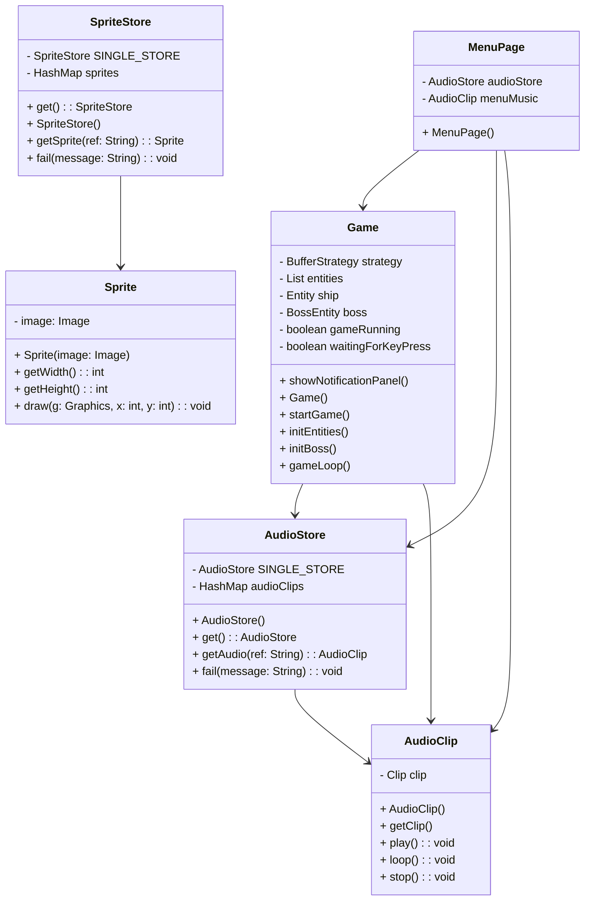
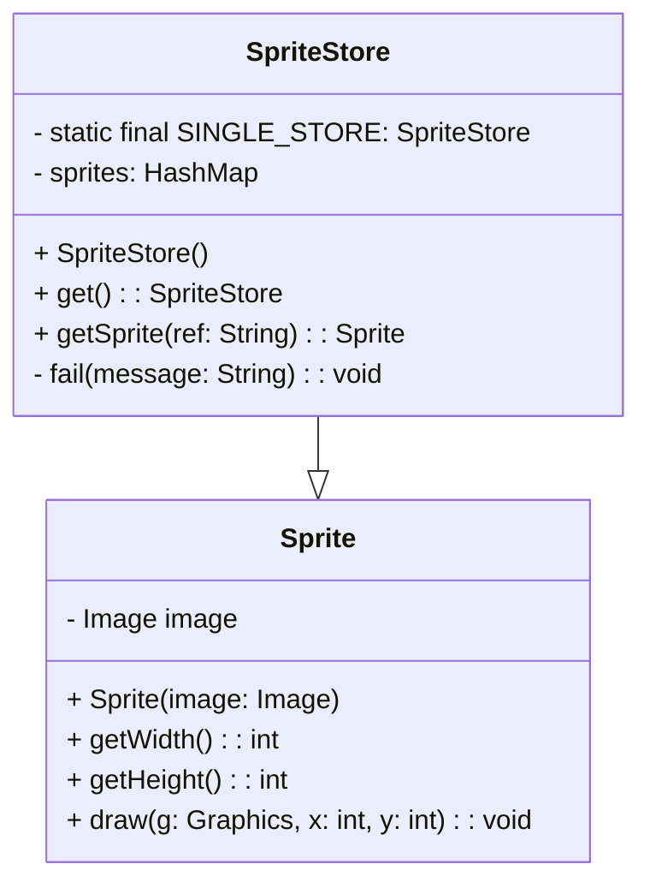
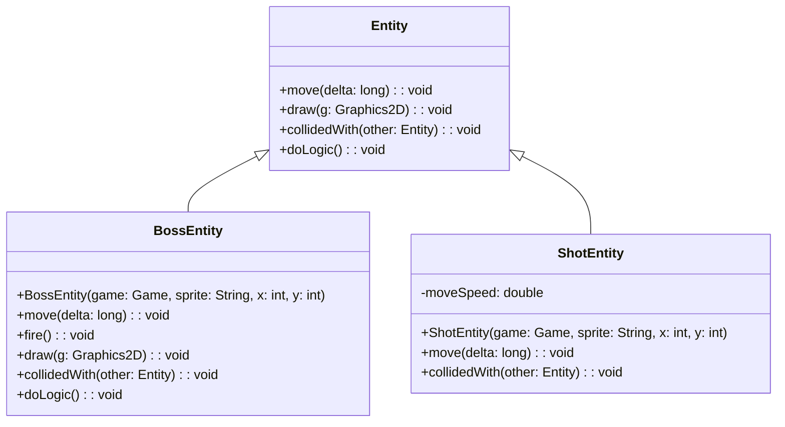
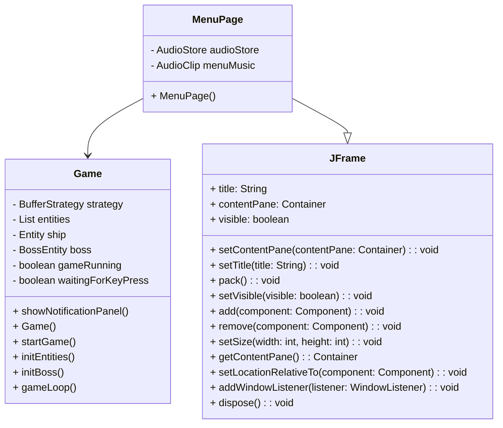
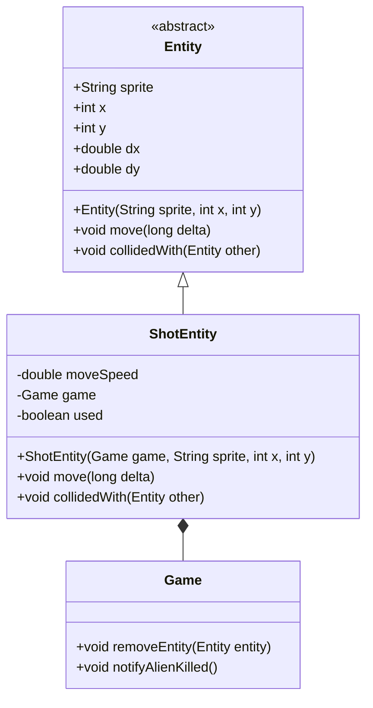

# SpaceInvaders-2.0
## Analisi 

Il progetto consiste nella realizzazione di un software basato su Java che consente ai giocatori di divertirsi con Space Invaders, uscito per la prima volta in Giappone nel 1978, in uno stile moderno, riuscendo allo stesso tempo a conservare quello originale. 

Il software Space Invaders dovrà permettere all’utente di giocare una partita in cui l’obiettivo è quello di distruggere un’orda di alieni che, partendo dalla parte alta dello schermo, scenderanno progressivamente verso il basso. Per poter vincere, il giocatore avrà ha disposizione una navicella spaziale con cui sparare ai nemici. Una volta eliminati gli alieni, verrà generata una entità chiamata Boss, la quale, come un alieno, sarà in grado di spostarsi verso destra e sinistra dello schermo, ma in più avrà la capacità di sparare dei proiettili, in modo da rendere più difficile il completamento del gioco. 

## Requisiti 

L’applicazione avrà dei requisiti fondamentali: 

- La presenza di una schermata detta Menù, che verrà visualizzata all’avvio del software. In questa finestra saranno presenti 3 opzioni tra cui scegliere: i comandi di gioco, ossia le informazioni principali su come giocare, la possibilità di decidere se cominciare il gioco vero e proprio o se chiudere il software 

- Se selezionata l’opzione di inizio gioco, una musica di sottofondo verrà riprodotta all’infinito, dunque in loop, per poter creare un’atmosfera coinvolgente 

- Saranno  fin da subito visibili l’orda di alieni e la navicella spaziale del giocatore. 

- Per poter iniziare, l’utente dovrà premere un tasto qualunque della tastiera 

- Una volta cominciata la partita, gli alieni saranno in grado di muoversi verso destra e sinistra dello schermo, cominciando a scendere gradualmente verso la parte bassa di esso, ossia verso il giocatore 

- L’utente dovrà pilotare la navicella spaziale posta nella parte bassa dello schermo e sarà in grado di muoversi verso destra e sinistra di esso. Inoltre, premendo un apposito tasto, l’utente avrà l’abilità di sparare proiettili per colpire i nemici  

- Ogni qual volta l’utente separerà un proiettile, sarà possibile sentirne il suono, per poter ulteriormente calare il giocatore nel clima di gioco 

- Una volta distrutta l’orda di alieni, l’entità Boss apparirà nella parte alta dello schermo. Anche quest'ultima avrà la capacità di muoversi verso destra e sinistra dello schermo, con la differenza che non sarà in grado di scendere verso il giocatore. Inoltre, come abilità aggiuntiva, il Boss potrà sparare proiettili, esattamente come la navicella spaziale del giocatore. Perciò, la sfida dell’utente sarà quella di colpire il Boss ed evitare a sua volta di essere colpito 

- Se il giocatore riuscirà a completare l’obiettivo finale, verrà visualizzato un messaggio che comunicherà la vittoria. Al contrario, se il giocatore verrà colpito o non riuscirà ad eliminare tutti gli alieni prima che essi lo raggiungano, sarà reso visibile un messaggio per annunciare la sconfitta

## Analisi e modello del dominio 
[Grafico 1]
Space Invaders permetterà al giocatore di pilotare una navicella spaziale con lo scopo di distruggere prima un’orda di alieni, poi un Boss, ossia un singolo alieno. Per fare ciò, avrà l’abilità di sparare proiettili, ma non sarà l’unico. Infatti, anche il Boss avrà la stessa capacità. L’orda di alieni viene identificata come un alieno singolo moltiplicato varie volte, dunque prende il nome di “AlienEntity”. Il giocatore, rappresentato con la navicella spaziale, viene definito come “ShipEntity”. I proiettili, anch’essi riconosciuti come una singola entità generata ogni qual volta il giocatore prema il relativo tasto sulla tastiera, prendono il nome di “ShotEntity”. Le entità di gioco presentano ciascuna un’immagine che le identifica, che viene detta “Sprite”. Più precisamente, per distinguere lo sparo del giocatore da quello del boss, sono state scelte due immagini differenti e ben distinguibili. Similmente, l'immagine identificativa del boss differisce da quella usata per rappresentare l'orde di alieni iniziale. La Sprite è infatti conservata all’interno di “Entity”, che rappresenta qualsiasi elemento presente nel software, in modo da poter essere utilizzata dalle varie entità. 

Oltre a queste entità principali, abbiamo anche identificato “Game”, che funge da mediatore centrale per la logica di gioco e la gestione dell'interfaccia utente. Esso coordina il ciclo di gioco, il rendering grafico, la gestione degli input utente e il controllo degli eventi di gioco. Inoltre, è presente una funzionalità interna a Game detta “KeyInputHandler”, che consente al giocatore di avviare il gioco e muovere la navicella attraverso i tasti della tastiera, in modo da raggiungere il suo obiettivo. 

[Grafico 1]


[Grafico 2] 
L'elemento che si apre una volta avviato il software è il Menù, che viene definito "MenuPage". Esso ha 3 opzioni, ognuna contenente una funzione; una di queste mostra i comandi di gioco, un'altra chiude la finestra del menù mentre l'ultima apre la schermata di gioco, richiamando un metodo in. Per quanto riguarda la terza opzione, il Menù è dunque collegato a Game, in modo tale che venga avviato il gioco correttamente. 
Inoltre, sia Game che MenuPage, contengono un riferimento ad "AudioStore" e "AudioClip", che gestiscono gli effetti sonori presenti all'interno del software. Il primo si occupa di gestire le risorse audio memorizzando gli AudioClip caricati per evitare di doverli ricaricare molteplici volte. Il secondo, invece, rappresenta un clip audio, ossia un suono caricato dall'AudioStore, utilizzato per creare un miglior ambiente di gioco. Allo stesso modo, è presente “SpriteStore”, che funge da amministratore delle risorse grafiche del gioco, fornendo un’interfaccia per ottenere le immagini necessarie, ossia le Sprite.

[Grafico 2]


## Design  
### Architettura  

Il design di Space Invaders è un'icona intramontabile nel mondo dei videogiochi, per cui abbiamo mantenuto una grafica classica, che rende il gioco semplice ed efficace. Le entità vengono visualizzate tramite un file gif mantenendo la tipica forma “di pixel” e gestite dalla classe “SpriteStore”, la quale funge da amministratore delle risorse grafiche del gioco, fornendo un’interfaccia per ottenere gli sprite necessari. Più precisamente, SpriteStore utilizza una mappa di hash per memorizzare gli sprite caricati al fine di evitare di ricaricarli più volte. Tale classe, dunque, lavora in maniera coordinata con la classe “Sprite”, la quale rappresenta un singolo sprite contenente solo l’immagine senza alcuna informazione sul suo stato, oltre ad altezza e larghezza. Perciò, quando SpriteStore viene richiamato per ottenere uno sprite, utilizza l’oggetto Sprite per creare un nuovo sprite se non è già presente nella sua cache. Di seguito lo schema UML per dare maggiore chiarezza: 


In maniera simile vengono gestiti gli effetti sonori del gioco attraverso le classi “AudioClip” e “AudioStore”: AudioStore funge da gestore delle risorse audio, fornendo un'interfaccia per ottenere gli AudioClip necessari e, similarmente a SpriteStore, utilizza una mappa di hash per memorizzare gli AudioClip caricati al fine di evitare di ricaricarli più volte, mentre AudioClip rappresenta un clip audio nel gioco e fornisce metodi per il controllo della riproduzione; Inoltre utilizza la classe Clip dell'API Java Sound per la riproduzione audio. Quindi AudioClip e AudioStore sono direttamente collegati con la classe Game, nella quale viene gestita l’intera logica del gioco, e con MenuPage dato che, all’inizio di ogni partita e mentre viene visualizzata la finestra iniziale di gioco, viene riprodotta in loop una musica di background (una relativa al menù e una al gioco vero e proprio). 

Il componente architetturale fondamentale di Spase Invaders è la classe “MenuPage”. Essa, infatti, è la prima finestra visibile al giocatore all’avvio del gioco ed è composta da tre bottoni che gestiscono rispettivamente: un piccolo menù illustrativo contenente i comandi principali, la chiusura della finestra di menù e l’avvio del gioco. A pari importanza vi è la classe Game il cui ruolo principale è quello della gestione della logica di gioco e che dipende da MenuPage in quanto, senza di essa, il gioco non potrebbe iniziare. Game quindi:  

- istanzia le varie entità presenti nel gioco come quella del boss, dell’orda aliena nemica e della navicella del giocatore con i relativi effetti sonori
- gestisce eventi come la pressione di un tasto della tastiera per permettere, per esempio, il movimento della navicella o lo sparo da parte del giocatore 

Ultimo componente architetturale, ma non per importanza, utilizzato dal software è la classe “Entity”, la quale rappresenta qualsiasi elemento che appare nel gioco. Uno dei suoi ruoli principali è quello della gestione risoluzione delle collisioni e del movimento implementando vari metodi. La classe Entity, infine, viene estesa in altre quattro classi per poter gestire in maniera indipendente le diverse entità presenti nel gioco riutilizzando i metodi “base” in essa implementati e aggiungendone dei nuovi, ove necessario. 

### Design dettagliato

– BossEntity (Martina) 

Problema: Nel contesto del gioco, ci si è trovati di fronte alla sfida di gestire il movimento del boss all'interno dello schermo e la sua capacità di sparare proiettili verso il giocatore, assicurando allo stesso tempo che il boss rimanga all'interno dei limiti dello schermo e che i proiettili vengano generati e sparati correttamente nella direzione desiderata. 

Soluzione: Per risolvere questo problema, si è fatto uso di due pattern di progettazione: il pattern Strategy per gestire il comportamento di sparare del boss e il pattern Template Method per definire il movimento del boss all'interno dello schermo. Più nello specifico, 

- Strategy Pattern: Il comportamento di sparare del boss è stato gestito tramite il metodo fire(), il quale crea e lancia un proiettile nella direzione desiderata e utilizzando un'interfaccia “FireStrategy” che rappresenta la strategia di sparare. L'interfaccia definisce il contratto per tutte le strategie di sparare implementate dalle classi concrete. Il metodo ha incapsulato il comportamento di sparare, consentendo una facile sostituzione dell'implementazione senza dover modificare il codice del boss stesso. L'utilizzo di questo pattern ha favorito la modularità e l'estensibilità del codice, permettendo di modificare il comportamento di sparare senza impattare sul resto del sistema di gioco. 
- Template Method Pattern: Il movimento del boss all'interno dello schermo è stato gestito tramite il metodo template “move()” nella classe “BossEntity”, che rappresenta un esempio di Template Method. Questo metodo ha fornito uno scheletro per il movimento del boss, lasciando alle sottoclassi il compito di implementare i dettagli specifici del movimento. Il Template Method Pattern ha permesso una maggiore flessibilità nel gestire il movimento del boss, facilitando eventuali modifiche future senza influire sul comportamento di altre entità nel gioco. 

L'utilizzo dell'interfaccia FireStrategy per il pattern Strategy e del metodo template move() per il pattern Template Method ha consentito di separare le responsabilità legate al comportamento di sparare e al movimento del boss, migliorando la manutenibilità e l'estensibilità del codice. In particolare, l'incapsulamento del comportamento di sparare tramite l'interfaccia FireStrategy ha reso più semplice l'aggiunta di nuovi tipi di attacchi del boss senza dover modificare direttamente la classe del boss. Allo stesso modo, l'utilizzo del metodo template move() ha permesso di adattare facilmente il comportamento del boss a eventuali cambiamenti nel design del gioco.  

Oltre all'utilizzo dei pattern di progettazione, è stato sfruttato il riuso del codice presente nella classe Entity. Quest'ultima fornisce funzionalità di base per tutte le entità del gioco, come il movimento, il disegno e la gestione delle collisioni. Il riuso del codice ha contribuito a ridurre la duplicazione e a migliorare la manutenibilità del sistema. L'implementazione dei pattern Strategy e Template Method, insieme al riuso del codice presente nella classe Entity, ha permesso dunque di gestire in modo efficace il comportamento di sparare e il movimento del boss nel contesto del gioco. Questo approccio ha favorito la modularità, l'estensibilità e la manutenibilità del codice, consentendo di adattare facilmente il comportamento del boss e di mantenere una buona struttura del sistema di gioco nel suo complesso. Di seguito la rappresentazione UML dell’applicazione dei due pattern. 


Il diagramma UML mostra la classe BossEntity che gestisce il comportamento del boss nel gioco. La classe ha un'associazione con la classe Game e contiene i metodi per il movimento, l'attacco e la gestione delle collisioni del boss. 

– MenuPage (Michela) 

Problema: Nel progettare la schermata di menù, si sono riscontrate diverse difficoltà. Innanzitutto, capire il corretto funzionamento e implementazione degli elementi che compongono il menù, ovvero i pulsanti. In secondo luogo, passare dal menù alla finestra di gioco attraverso l’uso di uno dei bottoni in modo regolare.

Dato che ciascun pulsante, se premuto, esegue una certa azione, far sì che quest’ultime vengano correttamente effettuate è stata la sfida principale. Di fatto, le difficoltà maggiori sono state riscontrate precisamente nel primo e nel terzo pulsante.  
Il primo è responsabile di far comparire sotto di esso una striga di testo che funge da guida per il giocatore, spiegandogli quali tasti della tastiera devono essere premuti per giocare. Il terzo, invece, svolge il compito più importante. Esso si occupa di avviare la schermata di gioco per poter consentire all’utente di iniziare la partita. Ciò rappresentò la sfida più complessa, poiché nei vari tentativi effettuati, il collegamento tra MenuPage e Game non era sempre eccellente. 
Più precisamente, i problemi furono: 
- Il terzo pulsante del menù apre la schermata di gioco ma, né suono né parte grafica, vengono correttamente visualizzate. La finestra di gioco appare completamente bianca. 
- Il terzo pulsante apre il gioco consentendo all’utente di visualizzarne gli elementi, ma i tasti della sua tastiera non sono funzionanti, ovvero non vengono letti correttamente come input per poter consentire al giocatore di muovere la navicella e sparare. Ciò non permette nemmeno agli alieni di muoversi nello schermo

Soluzione: Gli approcci iniziali al problema furono diversi. Per quanto riguarda il corretto funzionamento dei primi pulsanti e della loro generale implementazione, che comprende dimensione, colore e posizione, la soluzione fu semplice. Bastò semplicemente documentarsi online sull’uso di metodi come ad esempio “.setFont”, “.setForeground” e “.setLayout” e scegliere i più efficaci.  

Per far funzionare correttamente l’ultimo pulsante, invece, come approccio iniziale era stata aggiunta la schermata di menù all’interno di Game, per fare in modo che si aprisse come primo elemento per poi essere chiusa e lasciare il posto alla finestra di gioco. Dopo diversi tentativi, il menù fu creato come classe a sé stante, dunque al di fuori di classi già esistenti. In questo modo, non solo veniva aperto come primo elemento in modo regolare, ma fu più facile gestirne l’aspetto e le funzionalità. Inoltre, fu sfruttata JFrame, una classe di Java Swing che rappresenta un frame, ossia una finestra, che contiene diversi elementi. MenuPage ne estende le caratteristiche, dunque diventa un tipo di schermata che può essere visualizzata e avere le funzionalità fornite da JFrame.  

Per poter risolvere invece il problema principale, vale a dire il collegare menù e schermata di gioco, la soluzione fu l’uso di una sequenza di operazioni. Per prima cosa, fu utilizzato il metodo dispose() per poter chiudere la finestra del menù. Poi, la musica di background fu interrotta, per poter lasciare spazio a quella della schermata di gioco. Venne istanziata in seguito una nuova istanza della classe Game, per poter successivamente richiamare il metodo startGame(), appartenente a Game, che inizializza l’ambiente di gioco. Infine, fu utilizzato il seguente codice: “new Thread (() -> { game.gameLoop() }).start() “, che si occupa di avviare un nuovo thread per l’esecuzione del loop di gioco. Ciò viene eseguito per evitare che il ciclo di gioco blocchi l’event dispatch thread (EDT) della GUI (Graphical User Interface). Il loop di gioco, detto gameLoop, è un metodo della classe Game ed è responsabile dell'aggiornamento dello stato del gioco e del rendering della grafica. Trattandosi di un task di lunga durata, creando un nuovo thread specifico per questo metodo, esso viene eseguito in concomitanza con l’EDT, assicurando che l’interfaccia grafica rimanga reattiva mentre la logica di gioco viene eseguita in background. 
Grazie a questo tipo di approccio, il problema fu risolto correttamente, e la schermata di gioco è ora perfettamente collegata a quella del menù, permettendo all’utente di passare da quest’ultimo, che funge da presentazione a Space Invaders, al gioco vero e proprio.  

Per riassumere, utilizziamo un grafico UML per rappresentare i vari componenti presi in esame. 



Nell’UML vengono rappresentate le classi MenuPage, ovvero il menù, e Game, ossia il gioco vero e proprio. La relazione che gli elementi presentano è monodirezionale, ovvero il menù richiama il gioco poichè quest’ultimo viene aperto tramite l’uso di un pulsante presente nella schermata di presentazione di Space Invaders. Nello schema è presente anche JFrame, in modo da esplicitare il fatto che MenuPage ne estenda le caratteristiche. Infatti, molti dei metodi elencati nel grafico furono utilizzati per poter implementare correttamente il menù. 

-Collisione (Angelica) 

Problema: la collisione dello sparo è stata una parte complessa dello svolgimento del progetto.  

Soluzione: si è usato il metodo “collidedWith” che gestisce gli eventi di collisione tra il colpo e altre entità. Assicura che venga processato solo un evento di collisione per ogni colpo e procede a rimuovere le entità coinvolte e a notificare il gioco quando il colpo entra in collisione con un'entità di tipo AlienEntity. Questo metodo inoltre utilizza il pattern "Flag" impostando “used” a “true” quando il colpo colpisce un'entità, per evitare che il colpo la colpisca più volte. Il "pattern flag" è un design pattern che viene utilizzato per tenere traccia dello stato di un oggetto mediante l'uso di un flag booleano. Questo flag viene utilizzato per indicare se un particolare evento è già avvenuto o se un'azione è già stata eseguita. Il pattern flag è utile quando si desidera evitare di eseguire un'azione più volte o quando si vuole controllare se un certo evento è già accaduto. 

Viene utilizzato anche Template Method: I metodi “move(long delta)” e “collidedWith(Entity other)” definiscono lo scheletro di un algoritmo con il comportamento generale di movimento e gestione delle collisioni per un'entità colpo (ShotEntity). Questi metodi delegano alcune operazioni specifiche alle sottoclassi attraverso il concetto di ereditarietà. 

In ausilio ai pattern citati viene usato anche Single Responsibility Principle (SRP): Ogni metodo all'interno della classe ShotEntity ha un compito specifico e separato: il metodo “move” si occupa del movimento del colpo, il metodo “collidedWith” gestisce le collisioni e il metodo “createShot” si occupa di creare un nuovo colpo. Questo rispetta il principio SRP, che suggerisce che una classe dovrebbe avere una sola ragione per cambiare.



## Sviluppo
### Testing automatizzato 

I file di test presenti all’interno del progetto nella cartella “example”, sotto la voce “test”, sono stati sviluppati utilizzando il framework JUnit per verificare il corretto funzionamento di alcune classi. Questo approccio consente di eseguire i test in modo automatico, garantendo che le funzionalità del software siano valide e che eventuali modifiche non introducano regressioni. Infine, uso di suite specifiche come JUnit è vantaggioso, poiché semplifica l'esecuzione e la gestione dei test, contribuendo a una maggiore efficienza nel processo di sviluppo del software. 

### BossEntityTest.java
Implementa il testing automatizzato per esaminare il funzionamento della classe BossEntity. Tale test copre diversi aspetti del comportamento di BossEntity: 
- Inizializzazione: Il test testBossEntityInitialization() verifica che un'istanza di BossEntity sia correttamente inizializzata con le coordinate fornite e che non sia nulla. 
- Movimento: Il test testBossEntityMovement() controlla se l'entità si muove correttamente dopo un certo intervallo di tempo. 
- Inversione della direzione: Il test testBossEntityReverseDirection() verifica che l'entità inverta la direzione di movimento dopo aver raggiunto il bordo destro dello schermo. 
- Collisione con proiettile: Il test testBossEntityCollisionWithShot() simula una collisione tra l'entità e un proiettile, assicurandosi che venga emessa una notifica di vittoria. 


### MenuPageTest.java
Effettua il testing automatizzato per verificare il comportamento della classe MenuPage. Questo test si concentra su diversi aspetti critici del funzionamento della pagina di menu: 
- testTitle(): questo test controlla che il titolo della pagina di menu sia correttamente impostato su "Menu Page". Assicura che il titolo sia congruente con le aspettative. 
- testContentLabelVisibility(): verifica che l'etichetta del contenuto sulla pagina di menu non sia visibile inizialmente. Questo test assicura che il contenuto sia nascosto come previsto all'avvio della pagina. 
- testExitButtonAction(): simula il clic sul pulsante "Exit" della pagina di menu e verifica che la finestra della pagina di menu sia chiusa correttamente. Questo test assicura che il pulsante di uscita funzioni come previsto, chiudendo la finestra quando viene cliccato. 
- testStartButtonAction(): simula il clic sul pulsante "Start Game" della pagina di menu e verifica che la finestra della pagina di menu sia chiusa correttamente. Questo test assicura che il pulsante di avvio del gioco funzioni come previsto, chiudendo la finestra quando viene cliccato. 


### GameTest.java
Esegue una serie di test automatizzati per verificare il comportamento della classe Game. Questi test sono fondamentali per garantire che la logica del gioco funzioni correttamente e che il comportamento atteso sia rispettato. Analizziamo brevemente ciascun test: 
- testStartGame(): verifica che dopo aver avviato il gioco utilizzando il metodo startGame(), ci siano delle entità presenti nel gioco. Questo è importante perché assicura che l'inizializzazione del gioco abbia creato entità valide e che il gioco sia pronto per essere giocato. 
- testInitEntities(): controlla che il metodo initEntities() inizializzi correttamente le entità nel gioco. Verifica che ci siano delle entità presenti dopo l'inizializzazione e che siano configurate correttamente per il gioco iniziale. 
- testNotifyDeath(): assicura che il gioco entri in uno stato di attesa per la pressione di un tasto dopo che il giocatore muore. Questo è essenziale per gestire la transizione tra la fine del gioco e l'avvio di una nuova partita. 
- testNotifyWin(): Simile al test precedente, verifica che il gioco entri in uno stato di attesa per la pressione di un tasto dopo che il giocatore ha vinto la partita. Questo assicura una corretta gestione del completamento del gioco. 
- testCloseNotificationPanel(): si accerta che il pannello di notifica venga chiuso correttamente quando viene invocato il metodo closeNotificationPanel(). Assicura che il gioco torni allo stato normale dopo la chiusura della notifica. 


### ShipEntityTest.java
Testing automatizzato per verificare l’andamento della classe ShipEntity. Questo test analizza diversi aspetti del comportamento di questa entità: 
- testShipEntityInitialization(): test di inizializzazione che verifica la corretta inizializzazione di un’istanza di ShipEntity con delle coordinate (x,y) fornite. È necessario controllare inoltre che l’istanza non sia nulla. 
- testShipEntityLeftBoundary(): test che inizialmente crea un’istanza di ShipEntity con una posizione iniziale vicina al bordo sinistro dello schermo. Viene poi eseguito il metodo “move” per spostare la navicella verso il confine sinistro, e infine viene verificato che la sua posizione finale rimanga invariata. In particolare, verifica che la coordinata x finale della nave (ship.getX()) sia uguale alla sua coordinata x iniziale (initialX). 
- testShipEntityRightBoundary(): test simile al precedente. In questo caso, l’entità Ship viene spostata con il metodo “move” verso il confine destro dello schermo, per poter controllare che la sua posizione finale rimanga invariata.  
- testShipEntityCollisionWithAlien(): test che simula la collisione della navicella con un’entità Alien. Se va a buon fine, viene visualizzata una notifica di sconfitta, in quanto la navicella del giocatore, per poter vincere, deve eliminare tutti gli alieni evitando di essere raggiunto da questi.  


### ShotEntityTest.java
Verifica in automatico il comportamento della classe ShotEntity. Questo test, come visto nei precedenti, analizza diversi aspetti di Shot: 
- testShotEntityInitialization(): test che inizializza un’istanza di ShotEntity con delle coordinate precise, assicurandosi che non sia nulla. Inoltre, verifica che la velocità dello sparo sia corretta. 
- testShotEntityMovement(): test che registra la posizione Y iniziale dell'entità, la sposta con il metodo “move” e si assicura che questa sia stata spostata verso l'alto (la posizione Y è diminuita). 
- testShotEntityRemovalOffScreen(): test che si occupa di verificare la corretta rimozione dell’entità sparo una volta che questa si muove al di fuori dello schermo. Il test simula questo comportamento in modo da poter poi rimuovere l’entità come previsto. 
- testShotEntityCollisionWithAlien(): test che simula la collisione tra lo sparo e un’entità Alien. Si assicura che, in caso di collisione, entrambe le entità vengano rimosse. 


### SpriteTest.java
Implementa il testing automatizzato per verificare l’andamento della classe Sprite, più nello specifico: 
- testGetWidth() e testGetHeight() verificano se i metodi getWidth() e getHeight() della classe Sprite restituiscono correttamente rispettivamente la larghezza e l’altezza dell'immagine associata alla Sprite. Entrambi, dunque, creano un'istanza di BufferedImage con larghezza e altezza entrambe impostate su 50 pixel e tipo di immagine TYPE_INT_ARGB, per poi istanziare una Sprite utilizzando l'immagine appena creata. Successivamente i test verificano se i valori restituiti dai metodi getWidth() e GetHeight() sono uguali a 50. 
- testDraw() verifica se il metodo draw() della classe Sprite disegna correttamente l'immagine nell'oggetto Graphics2D, mantenendo le dimensioni originali dell'immagine. Il test per prima cosa crea un'istanza di BufferedImage come nel test precedentemente descritto, poi ottiene un oggetto Graphics2D associato all'immagine creata per generare un'istanza di Sprite. Successivamente chiama il metodo draw() passandogli l'oggetto Graphics2D e le coordinate (0,0) per poi verificare se le dimensioni dell'immagine sono rimaste invariate dopo il disegno. 


### AudioClipTest.java 
- testPlay controlla che il metodo play() non generi eccezioni quando viene chiamato. il test per prima cosa chiama il metodo play() su un oggetto audioClip. Poi utilizza un blocco try-catch per gestire qualsiasi eccezione che potrebbe essere generata durante l'esecuzione del metodo play(). Se il metodo play() viene eseguito senza generare eccezioni, il test passerà. Stessa cosa avviene per i test dei metodi Loop() e Stop(). 
- testGetClip confronta l'oggetto restituito dal metodo getClip() dell'oggetto audioClip con l'oggetto clip per verificare se sono uguali. il test chiama il metodo getClip() sull'oggetto audioClip e Confronta l'oggetto restituito con l'oggetto clip utilizzando assertEquals. Se i due oggetti non sono uguali, il test fallisce. 


Questi test forniscono una copertura di base per le funzionalità critiche del gioco, garantendo che il suo comportamento sia coerente con le aspettative e che eventuali modifiche non introducano regressioni indesiderate. 

Inoltre, l'utilizzo di suite specifiche come JUnit semplifica l'esecuzione e la gestione dei test, contribuendo a una maggiore efficienza nel processo di sviluppo del software.


## Note di sviluppo
### Martina
### Gestione degli eventi di input con KeyAdapter 
In questo caso: `KeyInputHandler`, `KeyAdapter`, `KeyEvent`, `keyPressed`, `keyReleased`, `keyTyped` 
#### Dove: Game 
#### Permalink: https://github.com/michelaminichini/SpaceInvaders-2.0/blob/main/app/src/main/java/org/example/Game.java 
#### Snippet: 
```java 
public class Game extends Canvas { 
    // ... altre variabili e metodi 
    public class KeyInputHandler extends KeyAdapter { 
        public void keyPressed(KeyEvent e) { 
            // ... gestione degli eventi di pressione dei tasti 
        } 
        public void keyReleased(KeyEvent e) { 
            // ... gestione degli eventi di rilascio dei tasti 
        } 
        public void keyTyped(KeyEvent e) { 
            // ... gestione degli eventi di digitazione dei tasti 
        } 
    } 
} 
``` 
Utilizzando una classe interna che estende `KeyAdapter`, il gioco gestisce in modo efficace gli eventi di input da tastiera, come la pressione, il rilascio e la digitazione dei tasti, semplificando la gestione dei controlli del giocatore. 


### Uso di Timer per il fuoco del boss 
In questo caso: `Timer`, `TimerTask`, `scheduleAtFixedRate` 
#### Dove:  BossEntity 
#### Permalink: https://github.com/michelaminichini/SpaceInvaders-2.0/blob/main/app/src/main/java/org/example/BossEntity.java 
#### Snippet: 
 ```java 
private Timer shotTimer; 
    public BossEntity(Game game, String sprite, int x, int y) { 
        super(sprite, x, y); 
        // other initialization code... 
        this.shotTimer = new Timer(); 
        this.shotTimer.scheduleAtFixedRate(new TimerTask() { 
            @Override 
            public void run() { 
                fire(); 
            } 
        }, 1000, 1000); 
    } 
``` 
Utilizza la classe `Timer` per pianificare e ripetere il fuoco del boss ad intervalli regolari. Questo approccio permette di gestire facilmente il comportamento periodico del fuoco senza dover implementare manualmente un sistema di timeout e schedulazione.


### Gestione delle collisioni efficiente 
#### Dove: in Entity e sue relative estensioni ma gestite in Game 
#### Permalink: https://github.com/michelaminichini/SpaceInvaders-2.0/blob/main/app/src/main/java/org/example/Game.java 
#### Snippet: 
```java 
    // Brute force collisions 
    for (int p = 0; p < entities.size(); p++) { 
        for (int s = p + 1; s < entities.size(); s++) { 
            Entity me = entities.get(p); 
            Entity him = entities.get(s); 
            // handle collision between entities 
            if (me.collidesWith(him)) { 
                me.collidedWith(him); 
                him.collidedWith(me); 
             } 
            // Check collision between boss's shots and other entities 
            if ((me instanceof ShotEntity && him instanceof BossEntity) || 
                (him instanceof ShotEntity && me instanceof BossEntity)) { 
                 if (me.collidesWith(him)) { 
                    me.collidedWith(him); 
                    him.collidedWith(me); 
                 } 
             } 
         } 
     } 
``` 
Utilizza un approccio "brute force" per gestire le collisioni tra tutte le entità nel gioco. Questo metodo può risultare inefficiente con un numero elevato di entità, ma è semplice da implementare e funziona bene per giochi con un numero limitato di elementi. Inoltre, gestisce specificamente le collisioni tra i proiettili del boss e le altre entità. 

### Michela
### Custom painting con paintComponent()
#### Dove: MenuPage
#### Permalink: https://github.com/michelaminichini/SpaceInvaders-2.0/blob/main/app/src/main/java/org/example/MenuPage.java
#### Snippet:
```java
@Override 

        protected void paintComponent(Graphics g){ 

            // Calls the paintComponent method of the superclass, which ensures that any default painting behavior provided by the superclass is executed 

            super.paintComponent(g);  

            // Check if a background image is available 

            if (backgroundImage != null){ 

                // Draw the background image onto the panel 

                g.drawImage(backgroundImage, 0, 0, getWidth(), getHeight(), this);  

            } 

        } 

```
`paintComponent()` è un metodo fornito dalla classe JComponent di Swing, che è una superclasse di vari componenti Swing come `JPanel`, `JButton`, ecc. Viene chiamato automaticamente dal framework Swing ogni volta che un componente deve essere dipinto o ridipinto sullo schermo.
Nella classe MenuPage, il metodo `paintComponent()` è sovrascritto all'interno di una classe interna anonima definita nell'istanziazione di `backgroundPanel`. Questo metodo è fondamentale per personalizzare il comportamento del pannello di sfondo (backgroundPanel). Quando viene invocato, riceve come parametro un oggetto Graphics (g), che rappresenta il contesto grafico per la pittura. La prima azione all'interno del metodo è l'invocazione di `super.paintComponent(g)`, assicurando che qualsiasi comportamento di pittura predefinito fornito dalla superclasse venga eseguito per primo. Successivamente, viene eseguito un controllo condizionale per verificare la disponibilità dell'immagine di sfondo (backgroundImage). Se l'immagine esiste, viene disegnata nel contesto grafico del pannello con il metodo `drawImage()`. Questo processo garantisce che l'immagine di sfondo, se presente, contribuisca all'aspetto visivo dell'interfaccia del menu, migliorando l'esperienza complessiva dell'utente. 

### Gestione delle collisioni tra navicella, entità aliena e sparo 
#### Dove: ShipEntity
#### Permalink: https://github.com/michelaminichini/SpaceInvaders-2.0/blob/main/app/src/main/java/org/example/ShipEntity.java 
#### Snippet:
```java
public void collidedWith(Entity other) { 

        // if it is an alien, notify the game that the player is dead 

        if (other instanceof AlienEntity || other instanceof ShotEntity) { 

            game.notifyDeath(); // the relevant notification window is displayed 

        } 

    } 
```
Il metodo `collidedWith()` della classe ShipEntity è fondamentale per gestire gli eventi di collisione che coinvolgono la navicella del giocatore. Accetta come parametro un oggetto Entity, che rappresenta l'entità con cui la nave si è scontrata. Utilizzando una logica condizionale, il metodo determina se l'entità che si è scontrata è un alieno (AlienEntity) o uno sparo (ShotEntity). Se l'entità che ha subito la collisione appartiene a uno di questi tipi, una notifica di sconfitta verrà visualizzata all’interno della finestra di gioco, poiché significa che l’utente ha perso la partita.  La complessità deriva dalla gestione degli eventi di collisione in un ambiente di gioco, compresa l'identificazione dei tipi di entità in collisione e l'orchestrazione dei corrispondenti cambiamenti di stato del gioco. 

### Componenti della GUI nel backgroundPanel
#### Dove: MenuPage
#### Permalink: https://github.com/michelaminichini/SpaceInvaders-2.0/blob/main/app/src/main/java/org/example/MenuPage.java
#### Snippet:
```java
GridBagConstraints gbc = new GridBagConstraints(); 

gbc.gridx = 0; 

gbc.gridy = 1; 

gbc.insets = new Insets(80, 0, 0, 0); 

gbc.anchor = GridBagConstraints.PAGE_END; 

backgroundPanel.setLayout(new GridBagLayout()); 

backgroundPanel.add(buttonPanel, gbc); 
```
Dimostra l'uso di `GridBagLayout` e `GridBagConstraints` per gestire la disposizione dei componenti della GUI all'interno del `backgroundPanel` nella classe MenuPage. 

`GridBagLayout` è un gestore di layout flessibile e potente, che consente di disporre i componenti in modo simile a una griglia, con dimensioni e allineamenti diversi. In questo caso, l'oggetto `GridBagConstraints` viene utilizzato per specificare i vincoli per il posizionamento del `buttonPanel` all'interno del `backgroundPanel`. Impostando proprietà come la posizione della griglia, gli insets e l'ancoraggio (anchor), si ottiene un controllo preciso sul layout, assicurando che il pannello sia posizionata correttamente all'interno dell'interfaccia.  

Questo metodo è fondamentale per creare interfacce utente funzionali, soprattutto in applicazioni complesse come i giochi, dove la disposizione dei componenti deve essere dinamica e adattabile a diverse dimensioni e risoluzioni dello schermo. La complessità deriva dalla specifica dettagliata dei vincoli di layout e dalla necessità di capire come questi influenzino il posizionamento e il dimensionamento dei componenti all'interno del layout. 

### Angelica
### Uso di BufferStrategy per il rendering 
#### Dove: Game 
#### Permalink: https://github.com/michelaminichini/SpaceInvaders-2.0/blob/main/app/src/main/java/org/example/Game.java 
#### Snippet: 
```java 
public class Game extends Canvas { 
    // ... altre variabili e metodi 
    public void gameLoop() { 
        // ... ciclo principale del gioco 
        createBufferStrategy(2); 
        strategy = getBufferStrategy(); 
        // ... altre operazioni nel loop 
        Graphics2D g = (Graphics2D) strategy.getDrawGraphics(); 
        // ... disegno delle entità e pulizia del buffer 
        g.dispose(); 
        strategy.show(); 
    } 
} 
``` 
Utilizzando `BufferStrategy`, il gioco gestisce il rendering in modo efficiente, eliminando artefatti visivi come lo screen tearing e migliorando le prestazioni complessive. Lo screen tearing si verifica quando il monitor aggiorna parzialmente l'immagine visualizzata durante il rendering di un nuovo frame. Con `BufferStrategy`, l'immagine completa viene disegnata in un buffer di memoria prima di essere visualizzata sullo schermo, evitando lo screen tearing. Inoltre, l'utilizzo di più buffer di memoria potrebbe compromettere la fluidità del rendering, ma grazie a `BufferStrategy`, che consente il disegno dei frame successivi mentre quello corrente viene mostrato, si ottiene una fluidità ottimale. 


### Uso di Java Swing per la gestione dell'interfaccia grafica 
#### Dove:  Game 
#### Permalink: https://github.com/michelaminichini/SpaceInvaders-2.0/blob/main/app/src/main/java/org/example/Game.java 
#### Snippet: 
```java 
public class Game extends Canvas { 
    // ... altre variabili e metodi 
    public Game() { 
        // ... inizializzazione del frame e del canvas 
        SwingUtilities.invokeLater(new Runnable() { 
            @Override 
            public void run() { 
                new Game(); 
            } 
        }); 
    } 
} 
```
Utilizzando `SwingUtilities.invokeLater()`, il gioco viene avviato all'interno dell'`Event Dispatch Thread (EDT)`; `SwingUtilities.invokeLater()` garantisce la sicurezza delle operazioni Swing e la corretta gestione dell'interfaccia grafica. Più nello specifico, assicura che il codice venga eseguito nell'EDT, anche se viene chiamato da un thread diverso. Se il codice che modifica l'interfaccia utente viene eseguito da un thread diverso dall'EDT, potrebbero verificarsi problemi di concorrenza, come la visualizzazione di componenti GUI non aggiornate o l'eccezione `IllegalStateException`. InvokeLater() risolve questo problema assicurando che il codice venga eseguito in modo sicuro nell'EDT.


### Uso di HashMap per memorizzare le istanze di oggetti Sprite in base alla loro chiave
#### Dove: SpriteStone 
#### Permalink: https://github.com/michelaminichini/SpaceInvaders-2.0/blob/main/app/src/main/java/org/example/SpriteStone.java
```java 
public class SpriteStore { 
    public static final SpriteStore SINGLE_STORE = new SpriteStore(); 
    public HashMap<String, Sprite> sprites = new HashMap<String, Sprite>(); 
    }
public static SpriteStore get() { 
        return SINGLE_STORE; 
    } 
```
la `HashMap` memorizza coppie di valori chiave-valore, dove la chiave è una stringa che rappresenta il riferimento all'immagine della Sprite, e il valore è l'istanza dell'oggetto Sprite corrispondente. Quindi, quando viene richiesto una Sprite utilizzando un riferimento all'immagine, la `HashMap` viene controllata per vedere se l'oggetto corrispondente è già stato caricato in precedenza. In caso affermativo, viene restituito la Sprite memorizzata, altrimenti viene caricata la Sprite dal file, memorizzato nella `HashMap` e restituito. In questo modo, viene evitato il continuo caricamento delle stesse immagini, migliorando le prestazioni del programma, specialmente in un contesto in cui le immagini vengono utilizzate più volte.


## Commenti finali
Per riassumere, l’applicazione software realizzata in Java vuole creare una versione 2.0, ossia una rivisitazione, del famoso gioco Space Invaders. Gli elementi principali come la navicella spaziale e gli alieni sono stati mantenuti invariati come nella versione originale, in modo da non allontanarsi troppo dal gioco tradizionale, con l’aggiunta però di una sprite identificativa innovativa che ne rivoluziona lo stile.  

Anche fattori grafici come le immagini di sfondo di gioco e del menù iniziale sono stati aggiunti in modo tale da distaccarsi dalla loro versione originale, per poter rendere lo stile di gioco più moderno.  

Altri elementi come le barriere che consentono al giocatore di proteggersi dagli spari degli alieni o il fatto di poter avere molteplici “vite”, ossia possibilità, prima di perdere la partita definitivamente, non sono stati implementati all’interno del presente progetto. Altri esempi sono: l’esistenza di svariati livelli di gioco, l’abilità delle orde nemiche di poter contrattaccare sparando come la navicella spaziale e un conteggio dei punti del giocatore.  

I casi citati in precedenza corrispondono a possibili fattori da inserire in futuro all’interno di Space Invaders. Insieme ad essi, si potrebbe includere l’aggiunta di una “barra della vita” che funge contatore dei punti vita del boss in modo da far capire al giocatore quante volte bisogna colpirlo per eliminarlo. Inoltre, si potrebbero implementare tre diverse modalità di gioco: facile, medio, difficile. Ciascuna corrisponde ad una versione del gioco leggermente diversa. Ad esempio, selezionando la terza opzione, gli alieni potrebbero essere in grado di muoversi verso il giocatore molto più velocemente rispetto alla prima modalità, oppure avrebbero l’abilità di sparare come le altre entità.  

Tuttavia, sono stati implementati diversi elementi innovativi non presenti nella versione originale del gioco. Tra questi notiamo: l’introduzione dell’entità boss al terminare dell’orda di alieni presente, la sua abilità di sparare proiettili contro il giocatore e la presenza di due finestre che fungono da notifica per l’utente in caso di vincita o perdita.


### Autovalutazione e lavori futuri
### Martina
Il mio ruolo principale all'interno del gruppo è stato quello di gestire la logica del gioco come, per esempio, il movimento dell'orda aliena, lo sparo della navicella del giocatore con il suo relativo movimento e l'entità del boss finale. Nonostante abbia riscontrato diverse problematiche nell'implementazione, le quali andrò ad illustrare successivamente, sono riuscita comunque a ottenere l'obiettivo che mi ero proposta di raggiungere. 

Per quanto riguarda l'orda aliena, il mio primo pensiero è stato quello di voler modernizzare la relativa logica di gioco aggiungendo il movimento della flotta, in quanto, inizialmente, come dimostrato dai numerosi video che ho personalmente esaminato riguardo l'originale Space Invaders, era limitata allo sparo contro il giocatore. Ho, quindi, implementato le varie funzioni, le quali mi hanno permesso di ottenere il movimento desiderato, ponendo maggior attenzione al "cambio di rotta" dovuto alla collisione con i bordi laterali della schermata di gioco.  

Lo scoglio principale, però, non è stata l'implementazione del precedente aspetto di gioco, ma quella relativa all'entità del boss. Nonostante non fosse una caratteristica esistente nella prima versione del videogame, ho comunque voluto provare a realizzarla, per rendere più immersiva l'esperienza del giocatore. In primo luogo, ho creato l'entità del boss riutilizzando il codice implementato per gli altri nemici in modo semplice e corretto, aggiungendo, inoltre, la possibilità di colpire il giocatore attraverso un loop di spari. Durante la realizzazione, sono riuscita a mantenere un codice facilmente comprensibile, permettendo, al tempo stesso, la possibilità di implementare successive feature di gioco come: la barra della vita, la gestione dei colpi, così che si possa eliminare la meccanica degli attacchi in loop, introducendo invece condizioni specifiche (es. il boss può sparare colpi solo se il giocatore si trova in una determinata area sottostante) e l'evocazione di ulteriori alieni nemici, nel caso in cui la vita del boss sia scesa sotto un certo limite. 

Una volta risolte le problematiche precedentemente esposte, ho dovuto far fronte ad un'altra complessa logica di gioco: associare il tocco di un tasto della tastiera ad un'azione della navicella del giocatore. Per prima cosa, ho creato le tre variabili che consentono il movimento destra/sinistra e lo sparo del giocatore, poi ho individuato lo strumento per effettuare l'associazione. In questo caso, mi è venuta in aiuto la libreria java "KeyEvent", che mi ha permesso di ottenere l'obiettivo desiderato, separando in due metodi distinti la gestione del momento di pressione del tasto e quello di rilascio in modo da controllarli in maniera indipendente.   

Per concludere posso affermare che, grazie alla mia dedizione, sono riuscita ad ottenere un buon lavoro sebbene io riconosca la necessità di effettuare qualche miglioramento, in quanto non ho mai avuto l'opportunità di interagire con lo sviluppo di videogiochi, anche se di natura semplice come quello che ho realizzato.

### Michela
Mi sono occupata principalmente dello sviluppo della schermata del menù iniziale e della realizzazione delle entità Ship e Shot. Considero il mio lavoro valido ed accurato, dato che ci ho impiegato costanza e dedizione.  

Inizialmente, non avendo mai lavorato alla realizzazione di un videogioco in Java, ho avuto diverse difficoltà, specialmente per quanto riguarda lo sviluppo della parte grafica legata al menù iniziale. Usufruendo di documentazioni e risorse online, sono poi riuscita a trovare i giusti mezzi per poter realizzare il lavoro, ottenendo ottimi risultati.  

Per quanto riguarda la creazione del menù, sono partita da un’idea molto semplice ma efficace; la necessità di un’introduzione al gioco, come una presentazione. Ho proseguito implementando i vari bottoni, ciascuno con la propria funzionalità, posizionandoli poi in posizioni ben precise. Per la parte più grafica, ho realizzato l’immagine utilizzata come sfondo in modo da richiamare lo stile retrò del gioco originale, aggiungendo poi una musica di sottofondo.  

In generale, il MenuPage combina l'impostazione dei componenti dell'interfaccia utente, la gestione degli eventi e l'inizializzazione del gioco in un'unica classe, il che può portare a una mancanza di separazione delle varie parti. Dunque, per migliorare il mantenimento del codice, si potrebbe provvedere a sistemare questo aspetto.

Nel creare l’entità Ship, sono stata in grado di regolarne il movimento in modo corretto ed efficace, controllando che l’elemento non esca dai bordi dello schermo. Riguardo al metodo responsabile di notificare quando la navicella si scontra con un’altra entità, il quale fu implementato in maniera adeguata, evitare di comprendere al suo interno il richiamo alla notifica di “morte” (quando il giocatore perde la partita) potrebbe essere un miglioramento notevole, in modo da rendere il codice più chiaro. In futuro, come possibili features aggiuntive, si potrebbe pensare di aggiungere la possibilità per il giocatore di avere a disposizione più vite, in modo da poter rigiocare una volta colpito da un alieno o dal boss. Inoltre, come sviluppo più complesso, si potrebbe implementare un pulsante all’interno del menù che permetta all’utente di scegliere tre diverse modalità di gioco, ad esempio “facile”,” medio/normale”, “difficile”.   

Infine, l’entità Shot, similmente alla classe precedente, eredita proprietà e metodi dalla classe Entity in maniera efficace, facilitando il riutilizzo del codice e mantenendo la coerenza tra i vari tipi di entità. Anche qui, i metodi principali sono stati realizzati correttamente, nonostante l’uso di magic numbers, che possono essere sostituiti con una variabile per migliorare la leggibilità e la manutenibilità del codice.  

Per tutti i componenti a cui mi sono dedicata, ho provveduto a riportare una documentazione esaustiva e completa, in modo da migliorare la comprensione del codice.   

In generale, sono abbastanza soddisfatta dei risultati ottenuti, soprattutto perchè il menù di gioco è risultato essere esattamente come me lo immaginavo. 

### Angelica (studente-lavoratore)
Mi sono occupata principalmente della parte audiovisiva del gioco e della realizzazione dell’estetica dell’alieno per rendere l’esperienza utente accattivante e retrò allo stesso tempo. Ritengo il mio lavoro discretamente buono, anche se avrei potuto cercare di collaborare di più con le mie colleghe. 

Nel processo di sviluppo dell'entità aliena, sono riuscita a gestire con successo un punto cruciale riscontrato durante l’implementazione: l’immagine, una volta raggiunto il bordo della finestra di gioco, non veniva rappresentata per intero, risultando quindi come “tagliata”, nonostante non fosse stato riscontrato alcun contrasto tra la dimensione della finestra e quella dell’alieno. Sono riuscita a risolvere l’errore selezionando accuratamente un’immagine adatta alle esigenze del movimento dell’entità, e implementando in maniera corretta la classe Sprite che spiegherò qui di seguito.  

Ogni componente del gioco è rappresentato da un’immagine, ovvero una sprite. Utilizzarla consente di usufruire di una singola immagine in diversi punti senza dover memorizzare più copie della stessa. Grazie al metodo ‘public void draw(Graphics g, int x, int y)’, si riesce a disegnare la sprite sul contesto grafico fornito alle coordinate (x, y) specificate. In seguito, utilizzando il metodo drawImage della classe Graphics, ho potuto disegnare l'immagine della sprite sullo schermo.  

Lo step successivo è stato quello di definire la classe SpriteStore, che funge da gestore delle risorse per le sprite nel gioco. Le funzionalità a cui mi sono dedicata con maggior attenzione sono il metodo getSprite(String ref) e `fail(String message). Il primo metodo si occupa di caricare e restituire una sprite dato un riferimento all'immagine e, se è già presente nella cache, viene restituita direttamente anziché ricaricarla. Il secondo metodo specificato implementa una procedura di utilità per gestire il fallimento del caricamento delle risorse, stampando un messaggio di errore e terminando il gioco.  

La definizione e gestione di AudioClip e AudioStore mi è risultata abbastanza semplice, in quanto sono riuscita ad affrontare l’implementazione di entrambe seguendo la medesima metodologia usata per Sprite e SpriteStore. 

Nonostante la scarsa conoscenza pregressa del linguaggio Java, grazie all’aiuto delle documentazioni, del materiale didattico messo a disposizione e soprattutto del sostegno delle mie compagne, posso dire che sono generalmente soddisfatta del lavoro eseguito e del raggiungimento degli obiettivi prestabiliti.


## Guida utente 
Per poter giocare a Space Invaders è necessario utilizzare pochi tasti: 
- Barra spaziatrice per sparare 
- Freccette (destra e sinistra) per muovere la navicella a destra o a sinistra 

I comandi di gioco sono stati inseriti all’interno del menù iniziale sotto l’opzione “commands”, in modo da poter leggere e ricordare le istruzioni poco prima di avviare il gioco. 
Per poter vincere, è necessario colpire prima di tutto ogni alieno presente nello schermo, poi il boss che apparirà subito dopo. Al contrario, se il giocatore viene colpito dagli alieni, poiché non in grado di eliminarli tutti in tempo, o dallo sparo del boss, viene considerato “game over”. 

Per avviare il videogioco attraverso il FatJar, seguire i seguenti passaggi:
1. clonare il repository del progetto sul proprio IDE
2. eseguire il seguente comando "gradle shadowJar" sulla root "rootLocalizzazioneDelClone/SpaceInvaders-2.0" che permetterà la creazione del file FatJar
3. l'eseguibile sarà disponibile nella cartella app/build/libs e, seguendo il medesimo percorso sull'esplora file, con un doppio click lanciare il file app-all.jar