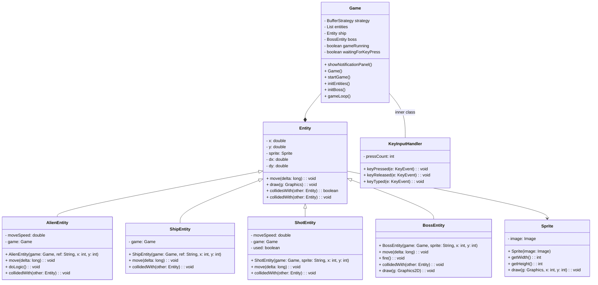
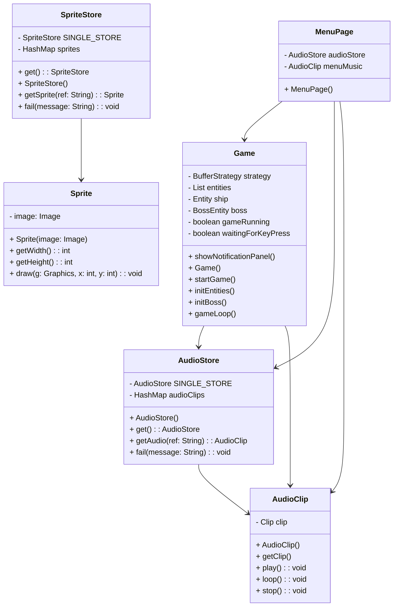
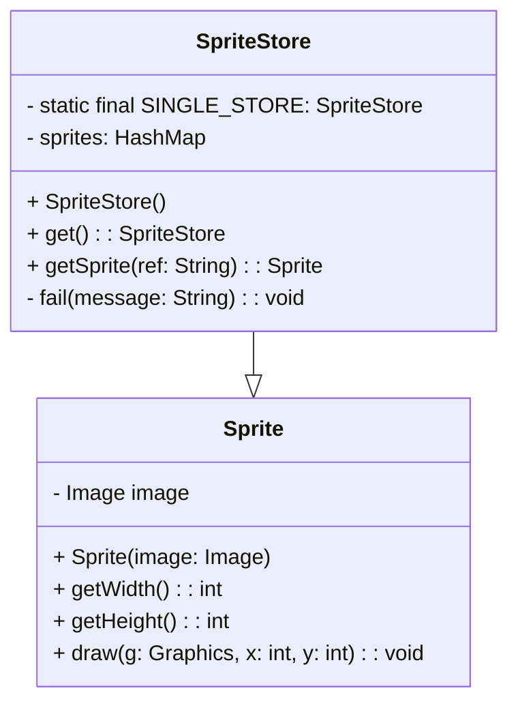
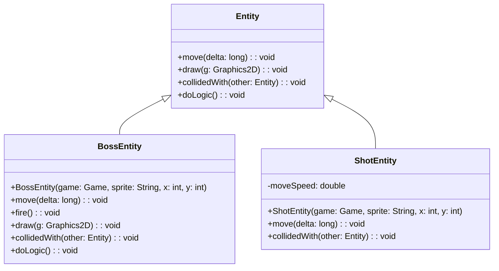

# SpaceInvaders-2.0
## Analisi 

Il progetto consiste nella realizzazione di un software basato su Java che consente ai giocatori di divertirsi con Space Invaders, uscito per la prima volta in Giappone nel 1978, in uno stile moderno, riuscendo allo stesso tempo a conservare quello originale. 

Il software Space Invaders dovrà permettere all’utente di giocare una partita in cui l’obiettivo è quello di distruggere un’orda di alieni che, partendo dalla parte alta dello schermo, scenderanno progressivamente verso il basso. Per poter vincere, il giocatore avrà ha disposizione una navicella spaziale con cui sparare ai nemici. Una volta eliminati gli alieni, verrà generata una entità chiamata Boss, la quale, come un alieno, sarà in grado di spostarsi verso destra e sinistra dello schermo, ma in più avrà la capacità di sparare dei proiettili, in modo da rendere più difficile il completamento del gioco. 

## Requisiti 

L’applicazione avrà dei requisiti fondamentali: 

- La presenza di una schermata detta Menù, che verrà visualizzata all’avvio del software. In questa finestra saranno presenti 3 opzioni tra cui scegliere: i comandi di gioco, ossia le informazioni principali su come giocare, la possibilità di decidere se cominciare il gioco vero e proprio o se chiudere il software 

- Se selezionata l’opzione di inizio gioco, una musica di sottofondo verrà riprodotta all’infinito, dunque in loop, per poter creare un’atmosfera coinvolgente 

- Saranno  fin da subito visibili l’orda di alieni e la navicella spaziale del giocatore. 

- Per poter iniziare, l’utente dovrà premere un tasto qualunque della tastiera 

- Una volta cominciata la partita, gli alieni saranno in grado di muoversi verso destra e sinistra dello schermo, cominciando a scendere gradualmente verso la parte bassa di esso, ossia verso il giocatore 

- L’utente dovrà pilotare la navicella spaziale posta nella parte bassa dello schermo e sarà in grado di muoversi verso destra e sinistra di esso. Inoltre, premendo un apposito tasto, l’utente avrà l’abilità di sparare proiettili per colpire i nemici  

- Ogni qual volta l’utente separerà un proiettile, sarà possibile sentirne il suono, per poter ulteriormente calare il giocatore nel clima di gioco 

- Una volta distrutta l’orda di alieni, l’entità Boss apparirà nella parte alta dello schermo. Anche quest'ultima avrà la capacità di muoversi verso destra e sinistra dello schermo, con la differenza che non sarà in grado di scendere verso il giocatore. Inoltre, come abilità aggiuntiva, il Boss potrà sparare proiettili, esattamente come la navicella spaziale del giocatore. Perciò, la sfida dell’utente sarà quella di colpire il Boss ed evitare a sua volta di essere colpito 

- Se il giocatore riuscirà a completare l’obiettivo finale, verrà visualizzato un messaggio che comunicherà la vittoria. Al contrario, se il giocatore verrà colpito o non riuscirà ad eliminare tutti gli alieni prima che essi lo raggiungano, sarà reso visibile un messaggio per annunciare la sconfitta

## Analisi e modello del dominio 
[Grafico 1]
Space Invaders permetterà al giocatore di pilotare una navicella spaziale con lo scopo di distruggere prima un’orda di alieni, poi un Boss, ossia un singolo alieno. Per fare ciò, avrà l’abilità di sparare proiettili, ma non sarà l’unico. Infatti, anche il Boss avrà la stessa capacità. L’orda di alieni viene identificata come un alieno singolo moltiplicato varie volte, dunque prende il nome di “AlienEntity”. Il giocatore, rappresentato con la navicella spaziale, viene definito come “ShipEntity”. I proiettili, anch’essi riconosciuti come una singola entità generata ogni qual volta il giocatore prema il relativo tasto sulla tastiera, prendono il nome di “ShotEntity”. Le entità di gioco presentano ciascuna un’immagine che le identifica, che viene detta “Sprite”. Più precisamente, per distinguere lo sparo del giocatore da quello del boss, sono state scelte due immagini differenti e ben distinguibili. Similmente, l'immagine identificativa del boss differisce da quella usata per rappresentare l'orde di alieni iniziale. La Sprite è infatti conservata all’interno di “Entity”, che rappresenta qualsiasi elemento presente nel software, in modo da poter essere utilizzata dalle varie entità. 

Oltre a queste entità principali, abbiamo anche identificato “Game”, che funge da mediatore centrale per la logica di gioco e la gestione dell'interfaccia utente. Esso coordina il ciclo di gioco, il rendering grafico, la gestione degli input utente e il controllo degli eventi di gioco. Inoltre, è presente una funzionalità interna a Game detta “KeyInputHandler”, che consente al giocatore di avviare il gioco e muovere la navicella attraverso i tasti della tastiera, in modo da raggiungere il suo obiettivo. 

[Grafico 1]

[Grafico 2] 
L'elemento che si apre una volta avviato il software è il Menù, che viene definito "MenuPage". Esso ha 3 opzioni, ognuna contenente una funzione; una di queste mostra i comandi di gioco, un'altra chiude la finestra del menù mentre l'ultima apre la schermata di gioco, richiamando un metodo in. Per quanto riguarda la terza opzione, il Menù è dunque collegato a Game, in modo tale che venga avviato il gioco correttamente. 
Inoltre, sia Game che MenuPage, contengono un riferimento ad "AudioStore" e "AudioClip", che gestiscono gli effetti sonori presenti all'interno del software. Il primo si occupa di gestire le risorse audio memorizzando gli AudioClip caricati per evitare di doverli ricaricare molteplici volte. Il secondo, invece, rappresenta un clip audio, ossia un suono caricato dall'AudioStore, utilizzato per creare un miglior ambiente di gioco. Allo stesso modo, è presente “SpriteStore”, che funge da amministratore delle risorse grafiche del gioco, fornendo un’interfaccia per ottenere le immagini necessarie, ossia le Sprite.

[Grafico 2]

## Design  
Architettura  

Il design di Space Invaders è un'icona intramontabile nel mondo dei videogiochi, per cui abbiamo mantenuto una grafica classica, che rende il gioco semplice ed efficace. Le entità vengono visualizzate tramite un file gif mantenendo la tipica forma “di pixel” e gestite dalla classe “SpriteStore”, la quale funge da amministratore delle risorse grafiche del gioco, fornendo un’interfaccia per ottenere gli sprite necessari. Più precisamente, SpriteStore utilizza una mappa di hash per memorizzare gli sprite caricati al fine di evitare di ricaricarli più volte. Tale classe, dunque, lavora in maniera coordinata con la classe “Sprite”, la quale rappresenta un singolo sprite contenente solo l’immagine senza alcuna informazione sul suo stato, oltre ad altezza e larghezza. Perciò, quando SpriteStore viene richiamato per ottenere uno sprite, utilizza l’oggetto Sprite per creare un nuovo sprite se non è già presente nella sua cache. Di seguito lo schema UML per dare maggiore chiarezza: 

In maniera simile vengono gestiti gli effetti sonori del gioco attraverso le classi “AudioClip” e “AudioStore”: AudioStore funge da gestore delle risorse audio, fornendo un'interfaccia per ottenere gli AudioClip necessari e, similarmente a SpriteStore, utilizza una mappa di hash per memorizzare gli AudioClip caricati al fine di evitare di ricaricarli più volte, mentre AudioClip rappresenta un clip audio nel gioco e fornisce metodi per il controllo della riproduzione; Inoltre utilizza la classe Clip dell'API Java Sound per la riproduzione audio. Quindi AudioClip e AudioStore sono direttamente collegati con la classe Game, nella quale viene gestita l’intera logica del gioco, e con MenuPage dato che, all’inizio di ogni partita e mentre viene visualizzata la finestra iniziale di gioco, viene riprodotta in loop una musica di background (una relativa al menù e una al gioco vero e proprio). 

Il componente architetturale fondamentale di Spase Invaders è la classe “MenuPage”. Essa, infatti, è la prima finestra visibile al giocatore all’avvio del gioco ed è composta da tre bottoni che gestiscono rispettivamente: un piccolo menù illustrativo contenente i comandi principali, la chiusura della finestra di menù e l’avvio del gioco. A pari importanza vi è la classe Game il cui ruolo principale è quello della gestione della logica di gioco e che dipende da MenuPage in quanto, senza di essa, il gioco non potrebbe iniziare. Game quindi:  

- istanzia le varie entità presenti nel gioco come quella del boss, dell’orda aliena nemica e della navicella del giocatore con i relativi effetti sonori
- gestisce eventi come la pressione di un tasto della tastiera per permettere, per esempio, il movimento della navicella o lo sparo da parte del giocatore 

Ultimo componente architetturale, ma non per importanza, utilizzato dal software è la classe “Entity”, la quale rappresenta qualsiasi elemento che appare nel gioco. Uno dei suoi ruoli principali è quello della gestione risoluzione delle collisioni e del movimento implementando vari metodi. La classe Entity, infine, viene estesa in altre quattro classi per poter gestire in maniera indipendente le diverse entità presenti nel gioco riutilizzando i metodi “base” in essa implementati e aggiungendone dei nuovi, ove necessario. 

Design dettagliato

– BossEntity (Martina) 

Problema: Nel contesto del gioco, ci si è trovati di fronte alla sfida di gestire il movimento del boss all'interno dello schermo e la sua capacità di sparare proiettili verso il giocatore, assicurando allo stesso tempo che il boss rimanga all'interno dei limiti dello schermo e che i proiettili vengano generati e sparati correttamente nella direzione desiderata. 

Soluzione: Per risolvere questo problema, si è fatto uso di due pattern di progettazione: il pattern Strategy per gestire il comportamento di sparare del boss e il pattern Template Method per definire il movimento del boss all'interno dello schermo. Più nello specifico, 

- Strategy Pattern: Il comportamento di sparare del boss è stato gestito tramite il metodo fire(), il quale crea e lancia un proiettile nella direzione desiderata e utilizzando un'interfaccia “FireStrategy” che rappresenta la strategia di sparare. L'interfaccia definisce il contratto per tutte le strategie di sparare implementate dalle classi concrete. Il metodo ha incapsulato il comportamento di sparare, consentendo una facile sostituzione dell'implementazione senza dover modificare il codice del boss stesso. L'utilizzo di questo pattern ha favorito la modularità e l'estensibilità del codice, permettendo di modificare il comportamento di sparare senza impattare sul resto del sistema di gioco. 
- Template Method Pattern: Il movimento del boss all'interno dello schermo è stato gestito tramite il metodo template “move()” nella classe “BossEntity”, che rappresenta un esempio di Template Method. Questo metodo ha fornito uno scheletro per il movimento del boss, lasciando alle sottoclassi il compito di implementare i dettagli specifici del movimento. Il Template Method Pattern ha permesso una maggiore flessibilità nel gestire il movimento del boss, facilitando eventuali modifiche future senza influire sul comportamento di altre entità nel gioco. 

L'utilizzo dell'interfaccia FireStrategy per il pattern Strategy e del metodo template move() per il pattern Template Method ha consentito di separare le responsabilità legate al comportamento di sparare e al movimento del boss, migliorando la manutenibilità e l'estensibilità del codice. In particolare, l'incapsulamento del comportamento di sparare tramite l'interfaccia FireStrategy ha reso più semplice l'aggiunta di nuovi tipi di attacchi del boss senza dover modificare direttamente la classe del boss. Allo stesso modo, l'utilizzo del metodo template move() ha permesso di adattare facilmente il comportamento del boss a eventuali cambiamenti nel design del gioco.  

Oltre all'utilizzo dei pattern di progettazione, è stato sfruttato il riuso del codice presente nella classe Entity. Quest'ultima fornisce funzionalità di base per tutte le entità del gioco, come il movimento, il disegno e la gestione delle collisioni. Il riuso del codice ha contribuito a ridurre la duplicazione e a migliorare la manutenibilità del sistema. L'implementazione dei pattern Strategy e Template Method, insieme al riuso del codice presente nella classe Entity, ha permesso dunque di gestire in modo efficace il comportamento di sparare e il movimento del boss nel contesto del gioco. Questo approccio ha favorito la modularità, l'estensibilità e la manutenibilità del codice, consentendo di adattare facilmente il comportamento del boss e di mantenere una buona struttura del sistema di gioco nel suo complesso. Di seguito la rappresentazione UML dell’applicazione dei due pattern. 

Il diagramma UML mostra la classe BossEntity che gestisce il comportamento del boss nel gioco. La classe ha un'associazione con la classe Game e contiene i metodi per il movimento, l'attacco e la gestione delle collisioni del boss. 