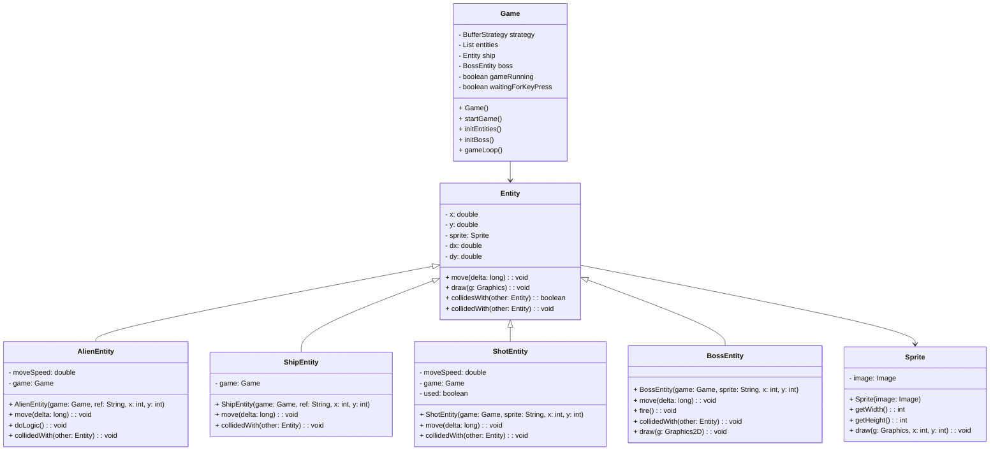

# SpaceInvaders-2.0
## Analisi 

Il progetto consiste nella realizzazione di un software basato su Java che consente ai giocatori di divertirsi con Space Invaders, uscito per la prima volta in Giappone nel 1978, in uno stile moderno, riuscendo allo stesso tempo a conservare quello originale. 

Il software Space Invaders dovrà permettere all’utente di giocare una partita in cui l’obiettivo è quello di distruggere un’orda di alieni che, partendo dalla parte alta dello schermo, scenderanno progressivamente verso il basso. Per poter vincere, il giocatore avrà ha disposizione una navicella spaziale con cui sparare ai nemici. Una volta eliminati gli alieni, verrà generata una entità chiamata Boss, la quale, come un alieno, sarà in grado di spostarsi verso destra e sinistra dello schermo, ma in più avrà la capacità di sparare dei proiettili, in modo da rendere più difficile il completamento del gioco. 

## Requisiti 

L’applicazione avrà dei requisiti fondamentali: 

- La presenza di una schermata detta Menù, che verrà visualizzata all’avvio del software. In questa finestra saranno presenti 3 opzioni tra cui scegliere: i comandi di gioco, ossia le informazioni principali su come giocare, la possibilità di decidere se cominciare il gioco vero e proprio o se chiudere il software 

- Se selezionata l’opzione di inizio gioco, una musica di sottofondo verrà riprodotta all’infinito, dunque in loop, per poter creare un’atmosfera coinvolgente 

- Saranno  fin da subito visibili l’orda di alieni e la navicella spaziale del giocatore. 

- Per poter iniziare, l’utente dovrà premere un tasto qualunque della tastiera 

- Una volta cominciata la partita, gli alieni saranno in grado di muoversi verso destra e sinistra dello schermo, cominciando a scendere gradualmente verso la parte bassa di esso, ossia verso il giocatore 

- L’utente dovrà pilotare la navicella spaziale posta nella parte bassa dello schermo e sarà in grado di muoversi verso destra e sinistra di esso. Inoltre, premendo un apposito tasto, l’utente avrà l’abilità di sparare proiettili per colpire i nemici  

- Ogni qual volta l’utente separerà un proiettile, sarà possibile sentirne il suono, per poter ulteriormente calare il giocatore nel clima di gioco 

- Una volta distrutta l’orda di alieni, l’entità Boss apparirà nella parte alta dello schermo. Anche quest'ultima avrà la capacità di muoversi verso destra e sinistra dello schermo, con la differenza che non sarà in grado di scendere verso il giocatore. Inoltre, come abilità aggiuntiva, il Boss potrà sparare proiettili, esattamente come la navicella spaziale del giocatore. Perciò, la sfida dell’utente sarà quella di colpire il Boss ed evitare a sua volta di essere colpito 

- Se il giocatore riuscirà a completare l’obiettivo finale, verrà visualizzato un messaggio che comunicherà la vittoria. Al contrario, se il giocatore verrà colpito o non riuscirà ad eliminare tutti gli alieni prima che essi lo raggiungano, sarà reso visibile un messaggio per annunciare la sconfitta

## Analisi e modello del dominio 
Space Invaders permetterà al giocatore di pilotare una navicella spaziale con lo scopo di distruggere prima un’orda di alieni, poi un Boss, ossia un singolo alieno. Per fare ciò, avrà l’abilità di sparare proiettili, ma non sarà l’unico. Infatti, anche il Boss avrà la stessa capacità. L’orda di alieni viene identificata come un alieno singolo moltiplicato varie volte, dunque prende il nome di “AlienEntity”. Il giocatore, rappresentato con la navicella spaziale, viene definito come “ShipEntity”. I proiettili, anch’essi riconosciuti come una singola entità generata ogni qual volta il giocatore prema il relativo tasto sulla tastiera, prendono il nome di “ShotEntity”. Le entità di gioco presentano ciascuna un’immagine che le identifica, che viene detta “Sprite”. Essa è infatti conservata all’interno di “Entity”, che rappresenta qualsiasi elemento presente nel software, in modo da poter essere utilizzata dalle varie entità. 

Oltre a queste entità principali, abbiamo anche identificato la classe “Game”, che funge da mediatore centrale per la logica di gioco e la gestione dell'interfaccia utente. Questa classe coordina il ciclo di gioco, il rendering grafico, la gestione degli input utente e il controllo degli eventi di gioco. Inoltre, è presente una funzionalità interna a Game detta “KeyInputHandler”, che consente al giocatore di avviare il gioco e muovere la navicella per poter raggiungere il suo obiettivo. 

